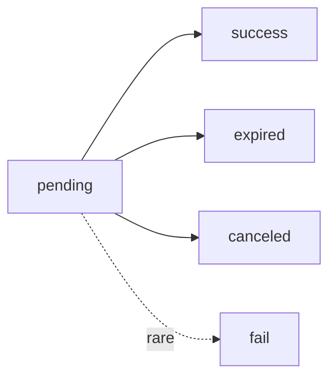

<Callout>
  **New here?** Read this page once end to end. It covers the conventions — authentication, the response envelope, pagination, money, idempotency, and errors — that every other page assumes you already know.
</Callout>

## What you can build

The Ecca Merchant API turns a checkout into three moving parts: you **create an invoice**, send your customer to a **hosted payment page**, and receive a **webhook** when the money settles. Everything else — listing invoices, reading payouts, discovering payment methods and live rates — is there to support that core flow.

<Columns cols="2">
  <Card title="Accept a payment" icon="receipt" horizontal="false" href="/invoices">
    Create an invoice, get a ready-to-use payment link.
  </Card>

  <Card title="Get notified" icon="webhook" horizontal="false" href="/webhooks">
    Receive a signed callback the moment an invoice settles.
  </Card>

  <Card title="Offer the right methods" icon="landmark" horizontal="false" href="/payment-methods">
    Show only the methods and currencies enabled for you.
  </Card>

  <Card title="Track your payouts" icon="send" horizontal="false" href="/withdrawals">
    List and inspect withdrawals programmatically.
  </Card>
</Columns>

## Quickstart

<Steps>
  <Step title="Get your API key" title-type="p">
    Grab your secret key from the dashboard. It authenticates every request via the `X-Api-Key` header. Keep it server-side only.

    ```bash
    export ECCA_KEY="sk_live_your_key_here"
    ```
  </Step>
  <Step title="Create an invoice" title-type="p">
    Send your order details. Use your own order id as `external_id` — it makes retries safe (see [Idempotency](#idempotency)).

    <CodeGroup show-lines="true">

    ```bash
    curl -X POST https://api.ecca.example/api/v1/external/invoices \
      -H "X-Api-Key: $ECCA_KEY" \
      -H "Content-Type: application/json" \
      -d '{
        "external_id": "order-4821",
        "customer_id": "user-99",
        "amount": "1050.00",
        "currency": "UAH",
        "purpose": "Order #4821"
      }'
    ```

    ```python
    import httpx
    
    resp = httpx.post(
        "https://api.ecca.example/api/v1/external/invoices",
        headers={"X-Api-Key": ECCA_KEY},
        json={
            "external_id": "order-4821",
            "customer_id": "user-99",
            "amount": "1050.00",   # string, max 2 decimals
            "currency": "UAH",
            "purpose": "Order #4821",
        },
    )
    invoice = resp.json()["data"]
    ```

    ```javascript
    const resp = await fetch(
      "https://api.ecca.example/api/v1/external/invoices",
      {
        method: "POST",
        headers: {
          "X-Api-Key": process.env.ECCA_KEY,
          "Content-Type": "application/json",
        },
        body: JSON.stringify({
          external_id: "order-4821",
          customer_id: "user-99",
          amount: "1050.00",
          currency: "UAH",
          purpose: "Order #4821",
        }),
      },
    );
    const { data: invoice } = await resp.json();
    ```

    </CodeGroup>
  </Step>
  <Step title="Redirect the customer" title-type="p">
    The response contains a ready-to-use `payment_url`. Send your customer there; they pick a method and pay on our hosted page.

    ```json
    {
      "success": true,
      "data": {
        "uuid": "9f2c1e5a-...",
        "external_id": "order-4821",
        "status": "pending",
        "amount": "1050.00",
        "currency": { "code": "UAH", "symbol": "₴" },
        "payment_url": "https://pay.ecca.example/i/9f2c1e5a-...?token=...",
        "expires_at": "2026-07-16T10:24:11Z"
      }
    }
    ```

    <Callout>
      `payment_url` is returned **only** to the creator (the `X-Api-Key` call). Store it or redirect immediately — a later public `GET` returns it as `null`.
    </Callout>
  </Step>
  <Step title="Receive the webhook" title-type="p">
    When the invoice settles, we `POST` to your `callback_url` with the final status. Acknowledge with `2xx`. Treat the webhook as the source of truth for fulfillment — see [WebHooks](/webhooks).
  </Step>
  <Step title="(Optional) Confirm by polling" title-type="p">
    As a fallback, read the invoice any time with its `order_id` **or** your `external_id`:

    ```bash
    curl https://api.ecca.example/api/v1/external/invoices/order-4821 \
      -H "X-Api-Key: $ECCA_KEY"
    ```
  </Step>
</Steps>

## Payment lifecycle

An invoice moves through a small, predictable set of states. Only `success` is terminal-and-good; the rest are final ways an invoice can end.



<ResponseField name="pending" required="false" deprecated="false">
  Created and waiting for the customer to pay. Has a live `payment_url` and an `expires_at`.
</ResponseField>

<ResponseField name="success" required="false" deprecated="false">
  Paid and credited. Fulfill the order. A webhook is delivered.
</ResponseField>

<ResponseField name="expired" required="false" deprecated="false">
  The payment window elapsed before payment. Create a new invoice to retry.
</ResponseField>

<ResponseField name="canceled" required="false" deprecated="false">
  Cancelled before payment.
</ResponseField>

<ResponseField name="fail" required="false" deprecated="false">
  A rare technical failure during settlement. Safe to treat like a non-success.
</ResponseField>

<Callout>
  Fulfill strictly on `success`. Never fulfill on `pending`, and never infer payment from the customer landing on your `success_url` — always confirm via the webhook or a `GET` on the invoice.
</Callout>

## Core concepts

<Expandable title="Business & API key">
  Your **business** is your merchant account. Each business has one or more **API keys** (`X-Api-Key`). A key authenticates you and scopes every response to your own data — you can never see another business's invoices.
</Expandable>

<Expandable title="Invoice, order_id & external_id">
  An **invoice** is a single payment order. It has two identifiers you can look it up by: `uuid` (our **order\_id**) and `external_id` (**your** order id). Both are accepted wherever an `{ident}` path parameter appears.
</Expandable>

<Expandable title="Payment method & currency">
  A **payment method** is a way to pay (a bank, a card scheme). Which methods and **currencies** are available depends on what's enabled for your business — discover them via [Payment Methods](/payment-methods) and [Currencies](/currencies) rather than hardcoding.
</Expandable>

<Expandable title="Webhook">
  A server-to-server callback we send to your `callback_url` when an invoice's status changes to a terminal state. Idempotent and retried on failure — see [WebHooks](/webhooks).
</Expandable>

## Base URL & versioning

```typescript
https://api.ecca.example/api/v1/external
```

<Callout>
  `v1` is the API version. Breaking changes ship under a new version prefix. Additive changes — new fields, new endpoints — can appear within `v1`, so **ignore unknown JSON fields** instead of failing on them.
</Callout>

## Authentication

Send your secret key in the **`X-Api-Key`** header on every request.

```bash
curl https://api.ecca.example/api/v1/external/rates \
  -H "X-Api-Key: sk_live_your_key_here"
```

<Callout>
  Your key is a secret: server-side only, never in a browser, mobile app, or git. Leaked? Revoke it in the dashboard and the old key dies instantly.
</Callout>

| Situation | Result |
| --- | --- |
| Missing or unknown key | `401 API_KEY_INVALID` |
| Revoked key | `403 API_KEY_REVOKED` |
| Business not active | `403 BUSINESS_NOT_ACTIVE` |
| Account blocked | `403 MERCHANT_BLOCKED` |

## Response envelope

Every response uses one envelope, so you write one parser. Success puts the payload under `data`:

```json
{ "success": true, "data": { "status": "pending" } }
```

Errors mirror it under `error`:

```json
{
  "success": false,
  "error": {
    "code": "INVOICE_ALREADY_EXISTS",
    "message": "Invoice with this external_id already exists",
    "details": { "external_id": "order-4821", "status": "pending" }
  }
}
```

<ResponseField name="success" required="false" deprecated="false">
  `true` on success, `false` on error. Always check this first.
</ResponseField>

<ResponseField name="data" required="false" deprecated="false">
  Present when `success` is `true`. The endpoint's payload (an object, or a [page](#pagination) for lists).
</ResponseField>

<ResponseField name="error" required="false" deprecated="false">
  Present when `success` is `false`.

  <Expandable title="properties">
    <ResponseField name="code" required="false" deprecated="false">
      Stable machine-readable code. **Branch on this**, not on the message.
    </ResponseField>

    <ResponseField name="message" required="false" deprecated="false">
      Human-readable text. May change between releases — don't parse it.
    </ResponseField>

    <ResponseField name="details" required="false" deprecated="false">
      Optional context. For validation errors, a map of `field → [messages]`.
    </ResponseField>
  </Expandable>
</ResponseField>

## HTTP status codes

The HTTP status gives the class of outcome; `error.code` gives the exact reason. The full catalog lives on the [Errors](/errors) page.

| Status | Meaning | Typical codes |
| --- | --- | --- |
| `200` | Success | — |
| `201` | Created | — |
| `401` | Authentication failed | `API_KEY_INVALID`, `UNAUTHORIZED` |
| `403` | Not allowed | `API_KEY_REVOKED`, `BUSINESS_NOT_ACTIVE`, `MERCHANT_BLOCKED` |
| `404` | Not found | `INVOICE_NOT_FOUND`, `PAYMENT_METHOD_NOT_FOUND` |
| `409` | State conflict | `INVOICE_ALREADY_EXISTS`, `INVOICE_NOT_PAYABLE` |
| `422` | Invalid request | `VALIDATION_ERROR`, `CURRENCY_NOT_ALLOWED` |
| `429` | Rate limited | `RATE_LIMITED`, `TOO_MANY_UNPAID_INVOICES` |
| `500` / `503` | Server-side problem | `INTERNAL_ERROR`, `DB_UNAVAILABLE` |

<Callout>
  A `422` returns `details` as `{field: [messages]}`, e.g. `{"amount": ["must have at most 2 decimal places"]}`. Log it to debug bad requests fast.
</Callout>

## Pagination

List endpoints take two query parameters and return a page object under `data`.

1-based page number. Items per page.

```json
{
  "success": true,
  "data": {
    "items": [],
    "page": 1,
    "per_page": 20,
    "total_items": 137,
    "total_pages": 7,
    "has_next": true,
    "has_prev": false
  }
}
```

To walk everything: start at `page=1` and keep going while `has_next` is `true`.

## Money & amounts

<Callout>
  All amounts are **strings** — `"1050.00"`, never `1050.0`. Parse with a decimal type (`decimal.Decimal`, `BigDecimal`), never a binary float, to avoid rounding errors.
</Callout>

Fiat amounts carry at most **two decimal places**; sending more is rejected with `422`. USDT amounts follow their own precision and are likewise strings.

## Timestamps

ISO 8601, always **UTC** (`"2026-07-16T09:24:11Z"`). Convert to local time for display only; store and compare in UTC.

## Idempotency

Creating an invoice is **idempotent on your \*\*\*\*`external_id`**. Retry `POST /external/invoices` with an id you've already used and you won't create a duplicate — you get `409 INVOICE_ALREADY_EXISTS` with the existing invoice's `status` in `details`.

<Callout>
  Always set a stable `external_id` per order. Network retries then become safe: a retried create can never double-charge your customer.
</Callout>

## Rate limiting

Requests are rate limited per API key. Over the limit → `429 RATE_LIMITED`. Back off and retry with exponential backoff. Some resources add their own guard, e.g. `429 TOO_MANY_UNPAID_INVOICES` when too many invoices sit unpaid.

## Errors

Branch on the stable `error.code` — never on the HTTP status alone or the `message`. The complete, grouped list is on the [Errors](/errors) page.